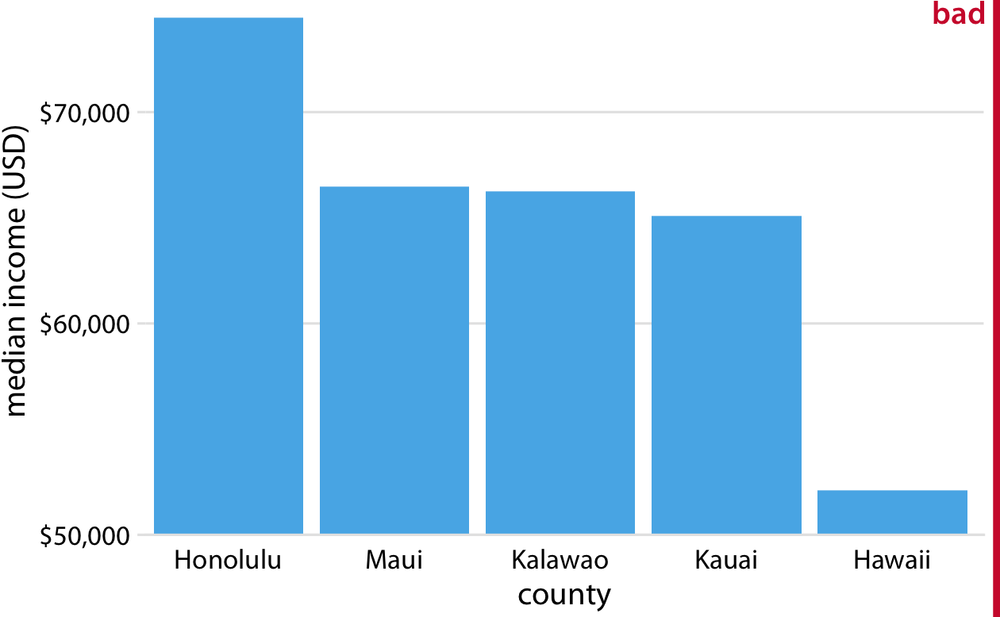
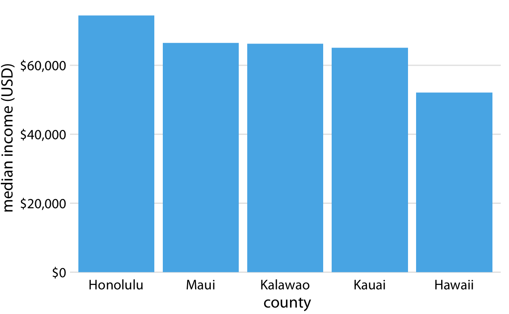
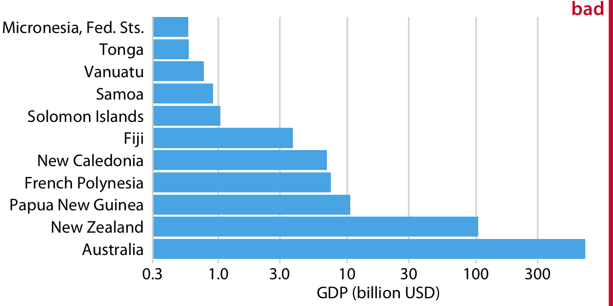
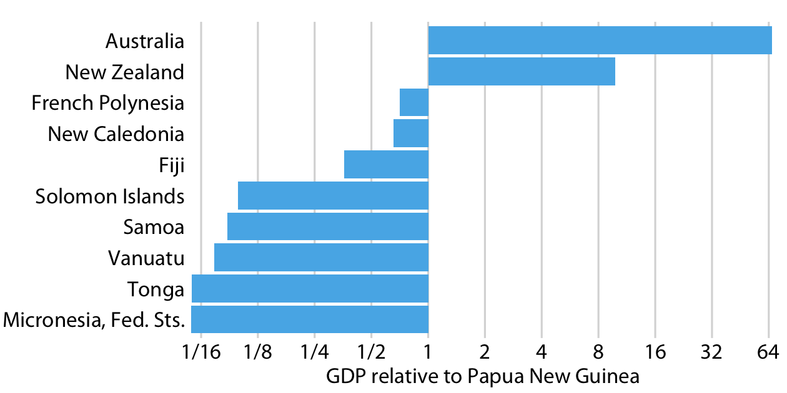

```{r setup, include=FALSE}
knitr::opts_chunk$set(comment = NA, prompt = TRUE, tidy = FALSE, collapse = TRUE)
library(tidyverse)
library(gridExtra)
```

# Part 1: From data to visualization

## Visualizaing data: Mapping data onto aesthetics
Something...

# Part II: Principles of figure design

## The principle of proportional ink
* Bars on a linear scale should always start at 0
* Be careful with log-scale (non-linear transformation)
* log-scale are more useful when comparing ratios.

## Bad
```{r, out.width = "560px", echo = FALSE, fig.align = 'center'}
## knitr::include_graphics("https://raw.githubusercontent.com/clauswilke/dataviz/master/_book_production/proportional_ink_files/figure-html/hawaii-income-bars-bad-1.png")

```

## Good

```{r, out.width = "560px", echo = FALSE, fig.align = 'center'}
## knitr::include_graphics("https://raw.githubusercontent.com/clauswilke/dataviz/master/_book_production/proportional_ink_files/figure-html/hawaii-income-bars-good-1.png")

```

## Bad
```{r, out.width = "560px", echo = FALSE, fig.align = 'center'}

```

## Good
```{r, out.width = "560px", echo = FALSE, fig.align = 'center'}

```

## Handling overlapping points
* Jitter points; `geom_jitter`
  * One downside of jittering is that it does change the data and therefore has to be performed with care. 
  * If we jitter too much, we end up placing points in locations that are not representative of the underlying dataset.
* Hexagonal heatmap; `geom_hex`
  
## Jitter
```{r, fig.align = 'center'}
dat <- tibble(x = rep(1:10, 10), 
              y = 2 * 1:10 - 4 * rep(1:10, each = 10))
g1 <- qplot(dat$x, dat$y)
g2 <- qplot(dat$x, dat$y) + geom_jitter()
grid.arrange(g1, g2, ncol = 2)
```

## Jitter
The last call added the points twice, one with `qplot` and one with `geom_jitter()`.
```{r}
ggplot(dat, aes(x, y)) + geom_jitter()
```

## Jitter
```{r}
dat <- do.call(rbind, replicate(15, dat, simplify = FALSE))
g1 <- qplot(dat$x, dat$y)
g2 <- ggplot(dat, aes(x, y)) + geom_jitter()
grid.arrange(g1, g2, ncol = 2)
```

## Hexagonal heatmap; better solution?
```{r}
g1 <- ggplot(dat, aes(x, y)) + geom_hex(bins = 5)
g2 <- ggplot(dat, aes(x, y)) + geom_hex(bins = 50)
grid.arrange(g1, g2, ncol = 2)
```

## Contour plot

```{r}
g1 <- ggplot(dat, aes(x, y)) + geom_density_2d()
g2 <- ggplot(dat, aes(x, y)) + 
  stat_density_2d(geom = "point", n = 10, aes(size = stat(density)), contour = F)
grid.arrange(g1, g2, ncol = 2)
```

## Common pitfalls of color use

* Color needs to be applied to serve a purpose.
    * It must be clear and must not distract.
* Use direct labeling instead of colors when you need to distinguish some points.
* Avoid large filled areas of overly saturated colors. 
    * They make it difficult for your reader to carefully inspect your figure.
* Use monotonic colors for ordinary variables.
* Be thoughtful for color-vision deficiency.
* To make sure your figures work for people with cvd, don't just rely on specific color scales. Instead, test your figures in a cvd simulator.  

## Redundant coding

* Whenever possible, design your figures so they don’t need a legend.

## Multi-panel figures

Small multiples 

* Always arrange the panels in a small multiples plot in a meaningful and logical order.
* Use the same scale (`x` axis and `y` axis) throughout the small multiples 

Compound figures

* Refer to with Fig xx.xx rather than top/left/bottom/right panel.
* lower case letters inside the figures
* Align figures
* Be coherent on content and colors

## Commonly used image file formats

Bitmap and vector graphics

* `pdf` (vector) is good for general purpose
* `png` (bitmap) is optimized for line drawings
* `jpeg` (bitmap) is optimized for photographic images

## Commonly used image file formats

* Vector graphics are "resolution-independent" 

    * They can be magnified to arbitrary size without losing detail or sharpness.

* Vector graphics have downsides

    * Vector graphics are redrawn on the fly by the graphics program with which they are displayed
    * Can show differences in how the same graphic looks in two different programs, or on two different computers. 
    * Large file sizes/slow to render for large/complex figures.
    
## Commonly used image file formats
    
* Most bitmap file formats employ some form of data compression to keep file sizes manageable.
* Could have side effects like blurry details.
*  Converting between image formats -- don't...


