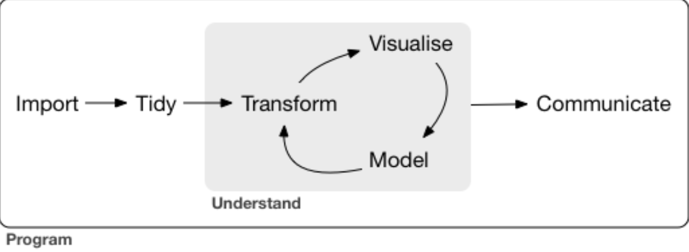

```{r setup, include=FALSE}
knitr::opts_chunk$set(comment = NA, prompt = TRUE, tidy = FALSE, collapse = TRUE, cache = TRUE)
library(tidyverse)
library(lubridate)
library(modelr)
options(na.action = na.warn)
```

# Part 1: `R`

## `R`: An interesting and useful language

Look at the date and time
```{r }
now()
```

What the day of the week when you were born?
```{r }
wday(ymd(19950813), label = TRUE)
```

Find the 2.5th and 97.5th percentiles of the Student $t$ distribution with 5 degrees of freedom.
```{r }
qt(c(.025, .975), df=5)
```

## `R` in Statistics: Functions in Packages 

This is an anova model: a randomized complete blocked design
$$Y_{ijk} = \mu_{...} + \rho_{i} + \tau_{j} + (\rho\tau)_{ij} + \epsilon_{ijk},$$
where:

   * $\mu_{...}$ is a constant 
   * $\rho_{i}$ and $\tau_{j}$ are constants subjects to the restrictions $\sum_{}\rho_{i}$ = $\sum_{}\tau_{j}$ = 0 
   * $(\rho\tau)_{ij}$ are constants subjects to the restrictions that sums to zero over $i$ or $j$
   * $\epsilon_{ijk}$ are independent $N(0,\sigma^2)$ 

```{r,eval=FALSE }   
model1 <- lm(GSI ~ Design * Side, data = dat)
summary(model1)
anova(model1)
dwtest(model1)
res1 <- resid(model1)
shapiro.test(res1)
model2 <- lm(GSI ~ Design + Side, data = dat)
anova(model1,model2)
```

* We will explore basic functions that are useful in data science.

<!-- * But this is not our goal to use the functions in packages directly. 
The goal of ***R for Data Science*** is to help you learn the most important tools in R that will allow you to do data science.-->


# Part II: What You Will Learn

## A Typical Data Science Project

* First you must import your data into `R`
* Second you've imported your data, it is a good idea to tidy it
* Third try to transform it, eg: creating new variables from the existing ones, summarisre statistics (counts or means)
* Fourth there are two main engines of knowledge generation: visualization and modeling
* The last step of data science is communication

```{r, out.width = "560px", echo = FALSE, fig.align = 'center'}

```


# Part III: Data Visualization with ggplot2

## ggplot2
* One of the most elegant and versatile systems for making graphs
* `ggplot` function from the `ggplot2` package,`ggplot2:ggplot()` 

The `mpg` Data Frame
```{r}
mpg
```

## The diamonds Data Frame
```{r}
diamonds
```

## Creating a `ggplot` object

```{r}
ggplot(data = mpg) + 
    geom_point(mapping = aes(x = displ, y = hwy))

#mpg %>%
  #qplot(x = displ,y = wt, geom = "point")
```


## Equivalent forms
Here are other approaches to construct `ggplot` objects that creates the same plot.

```{r, eval=FALSE, tidy = TRUE}
ggplot(data = mpg) + 
    geom_point(mapping = aes(x = displ, y = hwy))
```
```{r, eval=FALSE, tidy = TRUE}
ggplot(mpg)+
  geom_point(aes(displ, hwy))
```
```{r, eval=FALSE, tidy = TRUE}
mpg %>%
  ggplot(aes(displ, hwy))+
  geom_point()
```

## A Graphing Template

```{r}
## ggplot(data = <DATA>) +
##     <GEOM_FUNCTION>(
##           mapping = aes(<MAPPINGS>),
##              stat = <STAT>,
##        position  = <POSITION>
##      )+
##      <COORDINATE_FUNCTION> +
##      <FACET_FUNCTION>
```

#### There are plenty of `geom_function`, `coordinate_function`, `facet_functions`, etc., in `ggplot`, I just listed some common functions.

## `geom_point()`

* `geom_point()`: plot the points
* Add a third variable to a two dimensional scatterplot by mapping it to an aesthetic
```{r, fig.height=3.5, tidy = TRUE}
ggplot(data = mpg) + 
    geom_point(mapping = aes(x = displ, y = hwy, color = class))

```

## `geom_smooth()`

* `geom_smooth()`: plot the smooth lines
* `show.lengend = FALSE`: no lengend
* `se = FALSE`: no se interval in the `plot(shadow)`
```{r, fig.height = 3, tidy = TRUE }
ggplot(data = mpg) + 
    geom_smooth(mapping = aes(x = displ, y = hwy, color = drv))
```

## `geom_bar()`
* Bar chart, default the `y` is the count, `like stat_count()`.
* Categorical variables are usually saved as factors or character vectors, examine the distribution
of it, use a bar chart.
* For the barplot, the function removes the `NA` value.

```{r,fig.height = 3, tidy = TRUE}
ggplot(diamonds)+
  geom_bar(mapping = aes(x=cut))
```

## `..prop..`
```{r, tidy = TRUE}
ggplot(diamonds)+
  geom_bar(mapping = aes(x=cut, y= ..prop.., group = 1))
```

## `geom_histogram()`
* histogram
* To examine the continuous variables distribution, we usually use the histogram
```{r,fig.height = 3.5, tidy = TRUE}
ggplot(diamonds, mapping = aes(carat))+
  geom_histogram(binwidth = 0.5)
```

## `geom_freqpoly()`
* overlay multiple histograms in the same plot, `geom_freqpoly()` better than `geom_histogram()`.
* performs the same calculation as geom_histogram, but it saves as lines not bars.
```{r,fig.height = 3.5, tidy = TRUE}
ggplot(diamonds, mapping = aes(carat,color=cut))+
  geom_freqpoly(binwidth = 0.1)
```

## `geom_boxplot()`  

Boxplot:

* A box stretches from the 25th percentile of the distribution to the 75th percentile(IQR)
* Middle of the box is a line that display the median(symmetric or skewed to one side)  
* Visual points that display observations that fall more than 1.5 times the IQR from either edge of the box, the outlying points are unusual so plotted individually
* A line that extends from each end of the box and goes to the farthest nonoutlier point in the distribution

Display the distribution of a continuous variables broken down by a categorical one by boxplot 

## `R`
```{r, tidy = TRUE}
ggplot(mpg,aes(class,hwy))+
  geom_boxplot()
```

## `geom_abline()`

* Draw a line with a slope and intercept as parameters
```{r,fig.height=3.5, tidy = TRUE}
models <- tibble(
  a1 = runif(250,-20,40),
  a2 = runif(250,-5,-5))
ggplot(sim1,aes(x,y))+
  geom_abline(
    aes(intercept = a1, slope = a2),
    data = models, alpha = 1/4)+
  geom_point()
```

## `stat_count()`
```{r, tidy = TRUE}
ggplot(diamonds)+
  stat_count(mapping = aes(x=cut))
```

## `stat_summary()`

* summarizes the `y` values for each unique `x` value
```{r,fig.height=3.5, tidy = TRUE}
ggplot(diamonds)+
  stat_summary(
    mapping = aes(x=cut,y=depth),
    fun.ymin=min,
    fun.ymax=max,
    fun.y=median
  )
```

## `geom_jitter()`

* avoid the points overlap each other
* makes our graph less accurate at small scales, but it makes graph more revealing at large scales
```{r,fig.height=3.5, tidy = TRUE}
ggplot(mpg,mapping=aes(cty,hwy))+
  geom_point()+
  geom_jitter(width=0.5,height = 1)
```

## `coord_flip()`

* switches the x-axes and y-axes
* `coord_quickmap()`: sets the aspect ratio correctly for maps
* `coord_polar()`: use polar coordinates
```{r,fig.height=3.5, tidy = TRUE}
ggplot(mpg, mapping = aes(x = class, y = displ)) + 
  geom_boxplot()+
  coord_flip()
```

## `facet_wrap()` \& `facet_grid()`

* facet plot by a single variable(discrete)
```{r, tidy = TRUE}
ggplot(mpg)+geom_point(mapping = aes(x=displ,y=hwy))+facet_wrap(~cty,nrow=2)
ggplot(mpg)+geom_point(mapping = aes(x=displ,y=hwy))+facet_grid(.~cyl)
```

## Exercise 1
What has gone wrong with this code? Why are the points not blue? 
```{r, eval = TRUE, tidy = TRUE, message = FALSE}
ggplot(mpg)+
  geom_point(mapping = aes(x=displ,y=hwy,color="blue"))
```

## Exercise 2
Re-create the code necessary to generate the following graph
```{r,echo= FALSE, tidy = TRUE, message = FALSE}
ggplot(mpg, mapping = aes(x=displ, y=hwy))+
  geom_point(mapping = aes(color=class)) +
    geom_smooth(data=filter(mpg,class=="subcompact"), se= FALSE)
```


# Part IV: Graphs for Communication with `ggplot2`

## Label

* The easist place to start when turning an exploratory graphic into an expository graphic is with good labels
* Add labels with the `labs()` function

## `R`
```{r, tidy = TRUE,fig.height=3.5}
ggplot(mpg, aes(displ, hwy)) +
  geom_point(aes(color = class)) +
  geom_smooth(se = FALSE) +
  labs(
    x = "Engine displacement (L)",
    y = "Highway fuel economy (mpg)",
    color = "Car type"
  )
```

## Template:
* `title()`: add titile as to summarize the main finding
* `subtitle()`: adds additional detail in a smaller font beneath the title
* `caption()`: adds text at the bottom right of the plot, often used to describe the source of the data  
```{r}  
##ggplot()+
##  geom_function()+
##  labs(
##  title = "",
##  subtitle = "",
##  caption = ""
##  )
```

## `R`
```{r, fig.height = 3, tidy = TRUE} 
ggplot(mpg, aes(displ, hwy)) +
  geom_point(aes(color = class))+
  geom_smooth(se = FALSE) +
  labs(title = paste("Fuel efficiency generally decreases with","engine size"),
    subtitle = paste("Two seaters (sports cars) are an exception",
                     "because of their light weight"),
    caption = "Data from fueleconomy.gov"
  )
```


## `quote()`

* use mathematical equations instead of text strings
```{r, tidy = TRUE, fig.height=2.5} 
df <- tibble(
  x = runif(10),
  y = runif(10)
)
ggplot(df,aes(x,y)) +
  geom_point() +
  labs(
    x = quote(sum(x[i]^2, i == 1, n)),
    y = quote(alpha + beta + frac(delta, theta))
  )
```  

## `geom_label()`

* Draw a rectangle behind the text, use the `nudge_y` parameter to move the labels slightly above the corresponding points
* `ggrepel::geom_label_repel()` automatically adjusts labels
* Prepare to highlight the "best in class"
```{r}
best_in_class <- mpg %>%
  group_by(class) %>%
  filter(row_number(desc(hwy)) == 1)
```

## `geom_label()`
```{r, fig.height = 3, tidy = TRUE} 
ggplot(mpg, aes(displ, hwy))+
  geom_point(aes(color = class))+
  geom_point(size = 3, shape = 1, data = best_in_class)+
  ggrepel::geom_label_repel(
    aes(label = model),
    data = best_in_class)
``` 


## Axis Ticks 

```{r, tidy = TRUE} 
ggplot(mpg, aes(displ, hwy))+
  geom_point() +
  scale_y_continuous(breaks = seq(15,40, by = 5))
``` 

## `R`
```{r, tidy = TRUE, fig.height=4} 
ggplot(mpg, aes(displ, hwy))+
  geom_point(aes(color = class))+
  geom_smooth()+
  coord_cartesian(xlim = c(5,7), ylim = c(10,30))
```


# Part V: Brainstorm

## "-" in `R`

* matrics: `-n` means select all rows or columns except the nth, same as `FALSE`.
```{r, tidy = TRUE} 
(df <- tibble(x = 1:3, y = 3:1, z = letters[1:3]))
df[,-2]
df[,c(TRUE, TRUE, FALSE)]
```

## "-" in `R`

```{r, tidy = TRUE} 
remove_last <- function(x) {
  if (length(x) <= 1) return(NULL)
  x[-length(x)]
}
remove_last(c(1, 2, 3))
```

## "-" in `R`
```{r, tidy = TRUE} 
df<-tribble(
  ~y, ~x1, ~x2,
  4,   2,   5,
  5,   1,   6
)
model_matrix(df, y ~ x1)
#drop the intercept to the model
model_matrix(df, y ~ x1 - 1)

```

## `R`
* `arrange()`: `-` means descending order.
```{r, tidy = TRUE}
library(nycflights13)
arrange(flights,year,month,day)
q1<-arrange(flights,desc(arr_delay))
q2<-arrange(flights, -arr_delay)
identical(q1,q2)
```

## `R`
* `gather()`: `-` means gather all columns expect that one
```{r, tidy = TRUE}
table4a
table4a %>% gather(year,cases,-country)
```
